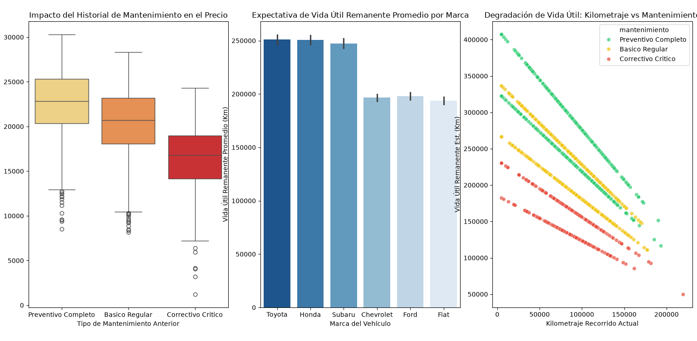

# Análisis Exploratorio de Datos (EDA) - Mercado Automotriz

Este proyecto realiza un análisis estadístico descriptivo y visual sobre el mercado secundario de vehículos, evaluando el impacto del kilometraje, la fiabilidad de la marca y el historial de mantenimiento en el precio de venta y la vida útil remanente.

## Visualización de Resultados

A continuación se presentan los gráficos generados por el script en español:

## Tecnologías Utilizadas
* Python 3.13
* Pandas & NumPy
* Matplotlib & Seaborn
* SciPy (Análisis Estadístico)